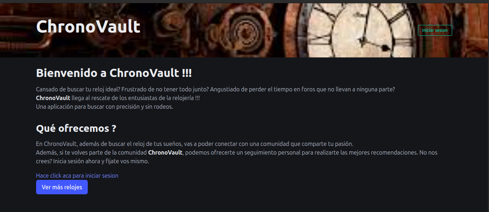
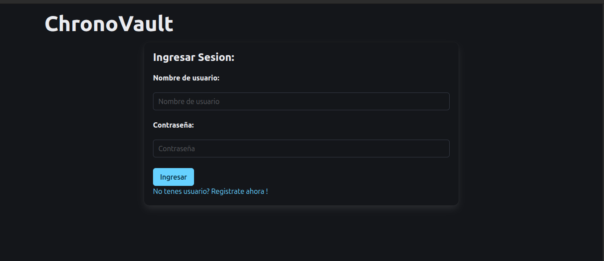
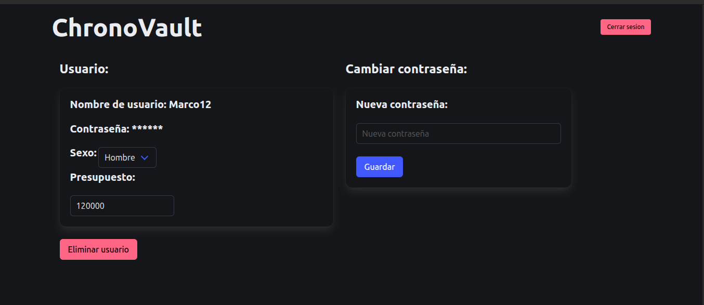

# Tp-Final
Trabajo práctico final de Introducción del Desarrollo del Software, Facultad de Ingeniería, Universidad de Buenos Aires.

ChronoVault:

Este proyecto consiste en una página web que le permite al usuario encontrar su reloj ideal gracias a una amplia base de datos y variadas herramientas.
Dentro de dichas herramientas se encontrará con un sistema de recomendaciones que le propone nuevos relojes  al usuario, utilizando la información recopilada acerca de sus relojes favoritos, o bien en base a aquellos que visitó recientemente. 
También presenta un sistema de filtros que le permite al usuario buscar relojes según las características que él mismo desea encontrar en el reloj de sus sueños.
E incluso ofrece una sección de reseñas para cada reloj, que le permitirá al usuario conocer de manera mucho mas objetiva todo lo bueno y lo malo de los relojes que otros sitios web no le dirían.

Para poder correr el proyecto de manera local, dispone de un Makefile con distintos comandos que le permiten tener el control de cada una de las partes del sistema. A continuación se presentan los comandos que deberá ejecutar en su terminal en cada caso:

Si es la primera vez que inicia el sistema del proyecto, ejecute los siguientes comandos en este orden:
 - make inicializar  --> Este comando descarga todas las dependencias necesarias para tener el proyecto corriendo de manera correcta.
 - make iniciarBdd  --> Este comando prepara e inicia en segundo plano el container que almacena la base de datos del sistema.
 - make iniciarBackend  --> Este comando inicia el backend del proyecto en su terminal actual.
 - Para ejecutar el siguiente comando deberá abrir una terminal nueva ya que en la que se encontrará en esté punto se encargará del backend.
 - make iniciarFrontend  --> Este comando inicia el frontend del proyecto en su terminal actual.

Si ya había iniciado el sistema del proyecto con anterioridad, ejecute los siguientes comandos en este orden:
 - make iniciarBdd  --> Este comando inicia en segundo plano el container que almacena la base de datos del sistema.
 - make iniciarBackend  --> Este comando inicia el backend del proyecto en su terminal actual.
 - Para ejecutar el siguiente comando deberá abrir una terminal nueva ya que en la que se encontrará en esté punto se encargará del backend.
 - make iniciarFrontend  --> Este comando inicia el frontend del proyecto en su terminal actual.

Si desea finalizar la ejecución del sistema del proyecto, ejecute los siguientes comandos en este orden:
 - ctrl+c --> Dentro de la terminal en la que ejecutó "make iniciarFrontend"
 - ctrl+c --> Dentro de la terminal en la que ejecutó "make iniciarBackend"
 - make detenerBdd --> Este comando interrupte y pausa la ejecución del container que almacena la base de datos del proyecto.

Si desea eliminar el container que almacena la base de datos del proyecto de forma permanente de su computadora:
 - make eliminarBdd  --> Este comando elimina el container de la base de datos y todas las redes creadas para el mismo.

Una vez iniciado el sistema del proyecto, para ingresar a ChronoVault solo debe ir a la siguiente dirección URL en su navegador:
 - http://localhost:8080/

Allí se encontrará con la página de inicio de ChronoVault. Y antes de comenzar a disfrutar de todo lo que esta tiene para ofrecerle, 
le recomendamos encarecidamente que inicie sesión con el botón de arriba a la derecha (que dice "iniciar sesion") para asi poder acceder 
a todas las herramientas y funcionalidades más avanzadas del sistema. De todos modos, si desea echarle un vistazo a la página sin la necesidad de iniciar sesión o crearse un usuario nuevo, puede hacerlo sin problema alguno:

Una vez presinado el botón para iniciar sesion, podrá ingresar su usuario y contraseña para logearse al sistema si es que ya tenía creada
una cuenta con anterioridad, o bien crear un nuevo usuario si es su primera vez en ChronoVault:

Para crear un usuario, tan solo debe ingresar el nombre por el que desea que lo conozcan en la comunidad ChronoVault y la contraseña con la que podrá luego ingresar a su cuenta:

Una vez realizado esto, tendrá la opción de personalizar su perfil con el precio que busca en su reloj ideal o su sexo, para que podamos 
brindarle las mejores recomendaciones en relojes en un futuro. Una vez realizado esto, presione en el logo de ChronoVault para acceder a la 
página con todos los relojes disponibles:

Desde esta sección podrá buscar todos los relojes que desee, utilizando nuestro sistema de filtros y/o de búsqueda por texto:

También podrá seleccionar el reloj que desea ver, agregarlo a sus favoritos, ver las reseñas de otros usuarios o incluso agregar la suya:

Una vez que haya estado navegando por la página el tiempo suficiente como para recolectar una buena cantidad de relojes favoritos y haberle
hechado un vistazo a aquellos que más le interesan, podrá ir devuelta a la página principal en la que se encontrará con una sección personalizada
con relojes que nosotros le recomendamos ver en base a sus gustos y preferencias.

